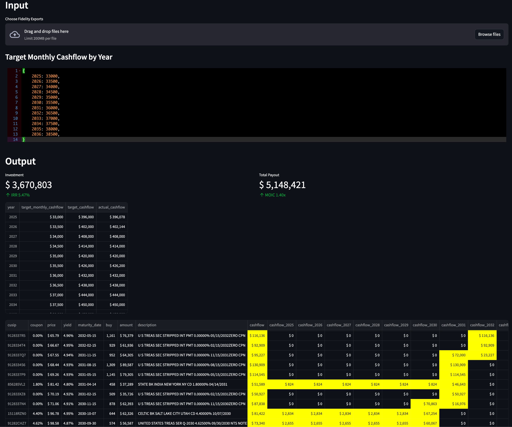

Fixed Income to Annuity [](https://github.com/pathikrit/fixed_income_annuity/actions/workflows/test.yml)
----

* Constructs an [annuity](https://www.investopedia.com/investing/overview-of-annuities/) with custom cashflow out of [bonds]([https://fixedincome.fidelity.com/ftgw/fi/FILanding#tbindividual-bonds|treasury](https://www.investopedia.com/financial-edge/0312/the-basics-of-bonds.aspx))
* Live Streamlit app: https://fixed-income-annuity.streamlit.app/

### Running locally

1. Prerequisites: You would need `git`, [`poetry`](https://python-poetry.org/docs/#installation) and [`streamlit`](https://docs.streamlit.io/library/get-started/installation)
2. Checkout this repo:
    ```shell
    git clone git@github.com:pathikrit/fixed_income_annuity.git
    cd fixed_income_annuity/
    ```
3. Download spreadsheet(s) of [fixed income products from Fidelity](https://fixedincome.fidelity.com/ftgw/fi/FILanding#tbindividual-bonds|treasury) that you want:

You can directly bookmark [these 2 links from my Chrome extension](https://github.com/pathikrit/chrome_ai/blob/c5cb23f3392d895825ef4d988d3b602c38b9d65c/index.js#L117-L118) that automates this.
4. Run: 
    ```shell
    poetry run streamlit run main.py
    ```
    This will open a browser window: 
5. You can use the above streamlit app to specify your Fidelity export files and specify target cashflow (see example in [tests](tests/test_calculator.py)) 


